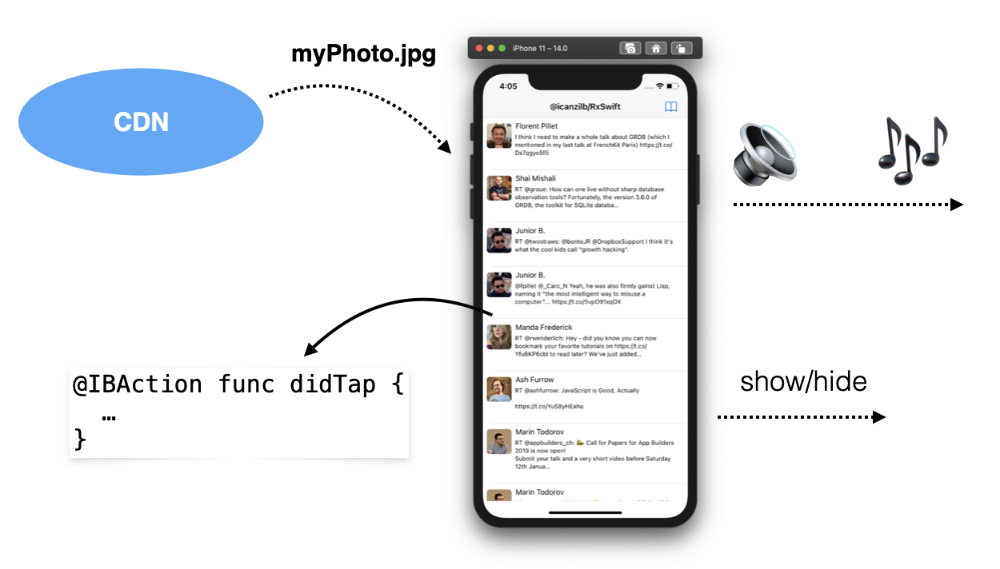
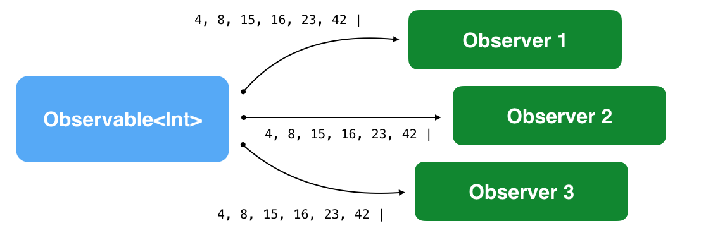
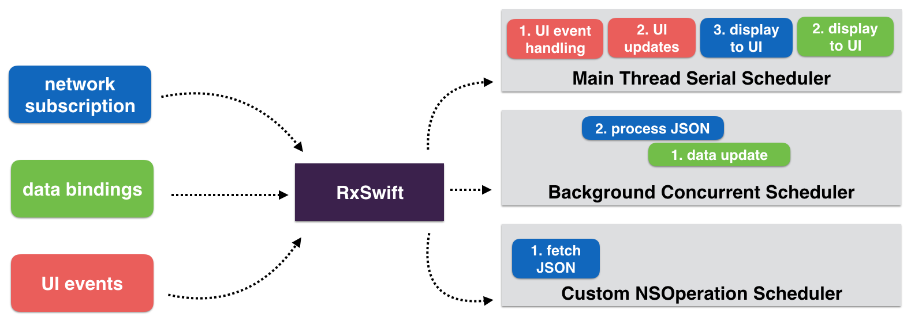

# 1 Hello, Rx Swift!

> **RxSwift**, in its essence, simplifies develping asynchronous programs by allowing your code to react to new data and process it in a _sequential, isolated_ manner, which is a library composing asynchronous and **event-based** code.

## Introduction to asynchronous programming.

It's a _prerequisite_ to learn RxSwift.



## Cocoa and UIKit asynchronous APIs

- `NotificationCenter`
- `Delegate Pattern`
- `GCD`
- `Closures`
- `Combine`

## Asynchronous programming glossary

1. State, and specifically, shared mutable state.

2. Imperative programming

   ```swift
   override func viewDidAppear(_ animated: Bool) {
       super.viewDidAppear(animated)

       setupUI()
       connectUIControls()
       createDataSource()
       listenForChanges()
   }
   ```

3. Side effects
   - Any changes to the state outside of your code's current scope.
   - Should be in a _controlled_ way.

## Declarative code

- Imperative Programming: Change state at will.

- Functional Programming: Aim to minimize the code that causes side effects.

> RxSwift Comgines some of the best aspects of two above.

- Declarative code: Define pieces of behavior.

## Reactive Systems

- `Responsive`: Keep the UI up to date

- `Resilient`: Each behavior is in isolation for flexible error recovery.

- `Elastic`: Handles varied workload.

- `Message-driven`: For improved reusability and isolation.

## Foundation of RxSwift

- **Observables**

- **Operators**

- **Schedulers**

## Observables

Provides the foundation of Rx code: Asynchronous events.

Allows one / more observers to react to any events or process and utilize new & incoming data.

- `Observable: ObservableType` can emit only three types of events:
  - `next` event
  - `completed` event
  - `error` event




## Finite observable sequences

Example for a file download.

1. Start the download and start observing.

2. `onNext`: Repeatedly receive chunks of data.

3. `onError`: The download will stop and display error.

4. `onCompleted`: Complete with success.

## Infinite observable sequences

- UIEvents are sucn infinite observable sequences.


```swift
UIDevice.rx.orientation
  .subscribe(onNext: { current in
    switch current {
    case .landscape:
      // Re-arrange UI for landscape
    case .portrait:
      // Re-arrange UI for portrait
    }
  })
```

## Operators

Can be composed together to implement more complex logic.

Deterministically process inputs & outputs till the expression has been resolved to a final value: side effects.

```swift
UIDevice.rx.orientation
  .filter { $0 != .landscape }
  .map { _ in "Portrait is the best!" }
  .subscribe(onNext: { string in
    showAlert(text: string)
  })

```

## Schedulers

The Rx equivalent of dispatch queus or operation queues, which covers 99% of use cases.



## App architecture

You can create apps with Rx by implementing any any patterns, such MVC, MVVM, and so on.

RxSwift and MVVM, play licely together.


## RxCocoa

The implementation of the common, platform-agnostic specification.

A companion library holding all classes, especially UIKit and Cocoa.

```swift
toggleSwitch.rx.isOn
  .subscribe(onNext: { isOn in
    print(isOn ? "It's ON" : "It's OFF")
  })
```


